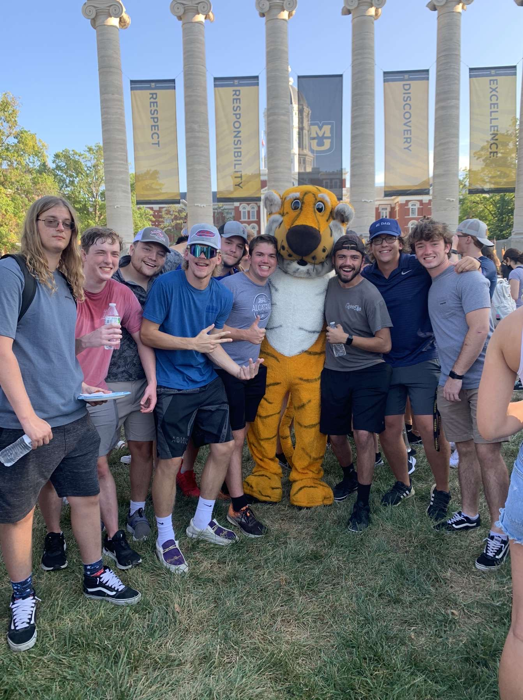

# Final-Project
<!DOCTYPE html>
<html>
<head>
</head>
<body>

<h3>Learn a little bit about the life of Adam DeRuntz</h3>

Learn all about my family, hobbies, and favorite things. 

<ul>
    <li><a href = "family.html" title = "My Family"> My Family </a></li>
    <li><a href = "intrest.html" title = "My Intrest"> My Intrest </a></li>
    <li><a href = "favorties.html" title = "My Favorite Things"> My Favorite Things </a></li>
    <li><a href = "code.html" title = "Some of my Code"> Some of my Code </a></li>
</ul>

</body>
</html>
